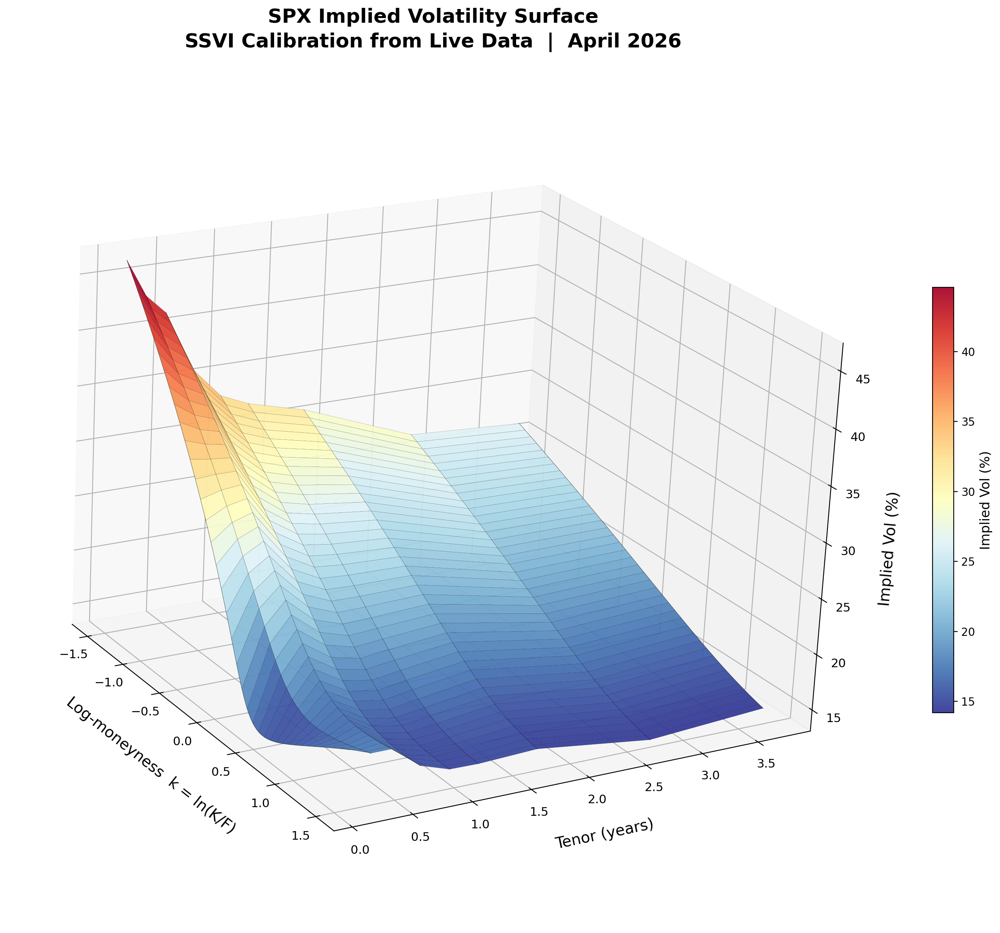
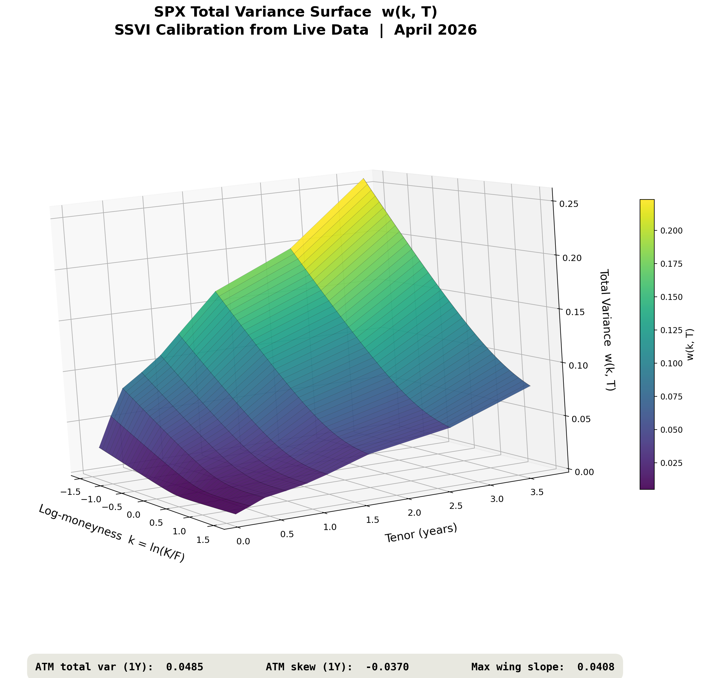

<div align="center">





# Arbitrage-Free Volatility Surface & Flow Hedging Optimizer

**Production-lite quantitative pipeline for equity derivatives **

[](https://python.org)
[](https://isocpp.org)
[](https://pybind11.readthedocs.io)
[](https://scikit-learn.org)
[](LICENSE)

[Quick Start](#-quick-start) · [Mathematical Theory](#-mathematical-theory) · [Architecture](#-architecture) · [Pipeline Walkthrough](#-pipeline-walkthrough) · [ML Warm-Start](#-ml-warm-start) · [Data Sources](#-data-sources)

</div>

---

## Overview

End-to-end derivatives pricing and risk system that calibrates an **arbitrage-free SSVI volatility surface** from live market data, computes full Greeks via a compiled C++17 engine, runs 2D scenario-based risk analysis, and optimises hedge portfolios on an efficient frontier — all from a single `python demo.py` call.

### Key Capabilities

| Module | What it does |
|--------|-------------|
| **C++ SSVI Engine** | Evaluates total variance + analytical derivatives at ~10M points/sec |
| **C++ Greeks Engine** | Black-Scholes pricing + finite-difference Greeks (delta through volga) |
| **Yield Curve** | Full FRED bootstrap (DGS1MO → DGS30), cubic spline interpolation |
| **Option Chain** | Live OPRA ingestion via Databento — 3,000+ SPX quotes across 19 expiries |
| **Forward Curve** | Implied forward curve from put-call parity, bootstrapped q(T) term structure |
| **Surface Calibration** | L-BFGS-B with arb penalty; calendar + butterfly checks post-fit |
| **Risk Ladder** | 2D full-revaluation P&L grid (spot × vol shocks) |
| **Hedge Optimizer** | SLSQP efficient frontier with transaction cost constraints |
| **ML Warm-Start** | GBT predicts SSVI param deltas → faster recalibration |

---

## Quick Start

```bash
# 1. Install dependencies
pip install -r qr_flow_project/requirements.txt

# 2. Build the C++ engine (required — no Python fallback)
cd qr_flow_project/cpp
python setup.py build_ext --inplace
# Windows: copy qr_engine*.pyd ..\
# Linux:   cp qr_engine*.so ../

# 3. Set your API keys
cat > qr_flow_project/.env <<EOF
FRED_API_KEY=your_fred_key_here
DATABENTO_API_KEY=your_databento_key_here
EOF

# 4. Run the full demo (live data)
cd qr_flow_project
python demo.py
```

All 6 publication-ready plots are saved to `output/`:

```
output/
├── 01_yield_curve.png
├── 02_vol_surface.png
├── 03_vol_surface_3d.png
├── 04_greeks.png
├── 05_risk_ladder.png
├── 06_efficient_frontier.png
└── warm_start.pkl
```

---

## Architecture

```
C++17 (pybind11) ─── REQUIRED           Python 3.11+
┌─────────────────────┐                  ┌──────────────────────────────┐
│ ssvi.cpp             │                  │ data/fred_rates.py           │
│  SSVI eval + derivs  │                  │  FRED yield curve bootstrap  │
├─────────────────────┤                  ├──────────────────────────────┤
│ greeks.cpp           │     bindings     │ data/options_chain.py        │
│  BS pricer + Greeks  │◄───────────────►│  CBOE CSV loader (backup)    │
├─────────────────────┤   (pybind11)     ├──────────────────────────────┤
│ bindings.cpp         │                  │ data/databento_chain.py      │
│  Python ⇄ C++ bridge │                  │  Databento OPRA chain        │
└─────────────────────┘                  ├──────────────────────────────┤
                                          │ data/dividends.py            │
                                          │  Implied fwd curve from PCP  │
                                          ├──────────────────────────────┤
                                          │ models/surface.py            │
                                          │  SSVI calibration orchestr.  │
                                          ├──────────────────────────────┤
                                          │ models/arb_detector.py       │
                                          │  Calendar + butterfly checks │
                                          ├──────────────────────────────┤
                                          │ models/etf_premium.py        │
                                          │  (unused in SPX flow)        │
                                          ├──────────────────────────────┤
                                          │ ml/warm_start.py             │
                                          │  GBT param delta predictor   │
                                          ├──────────────────────────────┤
                                          │ risk/risk_ladder.py          │
                                          │  2D full-revaluation grid    │
                                          ├──────────────────────────────┤
                                          │ risk/hedging.py              │
                                          │  Efficient frontier optimizer│
                                          └──────────────────────────────┘
```

---

## Pipeline Walkthrough

The full pipeline runs as a single script (`demo.py`) or interactively in `notebooks/walkthrough.ipynb`. Each section below shows real output from a live SPX run.

### 1 · C++ Engine Smoke Tests

The compiled `qr_engine` module exposes SSVI evaluation and Black-Scholes pricing directly to Python.

**Black-Scholes pricing** — European options on a forward $F$ with strike $K$, expiry $T$, rate $r$, vol $\sigma$:

$$C = e^{-rT}\bigl[F\,\Phi(d_1) - K\,\Phi(d_2)\bigr], \qquad P = e^{-rT}\bigl[K\,\Phi(-d_2) - F\,\Phi(-d_1)\bigr]$$

$$d_1 = \frac{\ln(F/K) + \tfrac{1}{2}\sigma^2 T}{\sigma\sqrt{T}}, \qquad d_2 = d_1 - \sigma\sqrt{T}$$

where $\Phi(\cdot)$ is the standard normal CDF.

```python
from qr_engine.ssvi import total_variance, derivatives as ssvi_derivs
from qr_engine.greeks import bs_price, bs_implied_vol, compute as greeks_compute

# SSVI total variance at ATM
theta, rho, eta = 0.04, -0.25, 1.0
w = total_variance(0.0, theta, rho, eta)
# => 0.040000

# Analytical derivatives for arb checks
d = ssvi_derivs(0.0, theta, rho, eta)
# => w=0.040000, dw/dk=-0.050000, d2w/dk2=0.468750

# Black-Scholes call pricing
call_px = bs_price(5850.0, 5900.0, 0.25, 0.045, 0.18, True)
# => $184.7210
```

**Put-call parity** — verified to machine precision ($C - P = e^{-rT}(F - K)$):

| Metric | Value |
|--------|-------|
| BS Call (F=5850, K=5900, T=0.25, σ=18%) | $184.7210 |
| BS Put | $234.1622 |
| C − P | −49.4412 |
| $(F-K)\,e^{-rT}$ | −49.4412 |
| IV round-trip error | $1.94 \times 10^{-16}$ |

**Greeks** — computed via central finite-difference bumps ($\delta_S = 0.005F$, $\delta_\sigma = 50\text{bps}$, $\delta_T = 1/365$):

| Greek | Definition | Value |
|-------|-----------|-------|
| Delta | $\Delta = \frac{\partial V}{\partial S}$ | 0.4749 |
| Gamma | $\Gamma = \frac{\partial^2 V}{\partial S^2}$ | 0.007481 |
| Vega | $\mathcal{V} = \frac{\partial V}{\partial \sigma}$ | 115.2431 |
| Theta | $\Theta = \frac{\partial V}{\partial T}$ | 40.7750 |
| Vanna | $\frac{\partial^2 V}{\partial S\,\partial \sigma}$ | 0.305474 |
| Volga | $\frac{\partial^2 V}{\partial \sigma^2}$ | 4.4331 |

---

### 2 · Yield Curve (FRED)

Bootstrapped from 11 US Treasury par yield series (DGS1MO → DGS30) via **cubic spline interpolation**.

**Par yield → continuous zero-rate conversion** (semi-annual compounding convention):

$$z(T) = 2\,\ln\!\left(1 + \frac{y_{\text{par}}(T)}{2}\right)$$

**Discount factor** at arbitrary tenor $T$ (interpolated via natural cubic spline through 11 knots):

$$D(T) = e^{-z(T)\,T}$$

```python
from python.data.fred_rates import fetch_yield_curve

curve = fetch_yield_curve(FRED_API_KEY)
# [LIVE] Fetched yield curve from FRED (as of 2026-02-28)
```

| Tenor | $z(T)$ | $D(T) = e^{-zT}$ |
|-------|-----------|-----------------|
| 0.25y | 4.339% | 0.9892 |
| 1.00y | 4.218% | 0.9587 |
| 5.00y | 4.148% | 0.8123 |
| 10.00y | 4.443% | 0.6413 |

<div align="center">


*US Treasury zero curve bootstrapped from FRED — cubic spline through 11 tenor points*
</div>

---

### 3 · Option Chain (Databento)

```python
from python.data.databento_chain import fetch_databento
chain = fetch_databento("SPX")
# [LIVE] Fetched 3,124 quotes across 19 expiries for SPX (spot=6583.35)
```

| Expiry | T (years) | Quotes |
|--------|-----------|--------|
| 2026-03-06 | 0.011 | 198 |
| 2026-03-20 | 0.049 | 245 |
| 2026-03-31 | 0.079 | 312 |
| 2026-06-18 | 0.296 | 187 |
| 2026-09-17 | 0.545 | 164 |
| 2026-12-18 | 0.797 | 203 |
| 2027-06-17 | 1.292 | 178 |

---

### 4 · Forward Curve (Implied from Put-Call Parity)

For European index options (SPX), the forward price is extracted directly from put-call parity at each expiry, then a continuous dividend yield term structure $q(T)$ is bootstrapped.

**Implied forward from put-call parity** — at each expiry $T$ with ATM strike $K$:

$$F(T) = K + e^{rT}\bigl(C_{\text{ATM}} - P_{\text{ATM}}\bigr)$$

**Dividend yield bootstrap** — continuous yield $q(T)$ implied from the forward:

$$q(T) = r(T) - \frac{\ln(F/S)}{T}$$

**Continuous forward** — reconstructed from the bootstrapped term structure:

$$F(T) = S\,e^{(r-q)\,T}$$

```python
from python.data.dividends import build_forward_curve_index

forwards, fwd_curve = build_forward_curve_index(spot, chain, curve)
# [LIVE] Built forward curve from 19 expiry slices (SPX spot=6583.35)
```

**Implied forward curve (sample):**

| Expiry | $T$ | $F(T)$ | $r(T)$ | $q(T)$ | $r - q$ |
|--------|-----|--------|---------|---------|---------|
| 2026-03-20 | 0.049y | 6583.92 | 4.34% | 1.12% | 3.22% |
| 2026-06-18 | 0.296y | 6612.41 | 4.22% | 1.26% | 2.96% |
| 2026-12-18 | 0.797y | 6738.15 | 4.15% | 1.19% | 2.96% |
| 2027-06-17 | 1.292y | 6834.09 | 4.18% | 1.22% | 2.96% |

---

### 5 · SSVI Surface Calibration + Arb Detection

The volatility surface is parameterised using Gatheral & Jacquier's **Surface SVI (SSVI)** model.

**SSVI total variance** at log-moneyness $k = \ln(K/F)$ for a tenor slice with ATM total variance $\theta$, skew $\rho$, and curvature $\eta$:

$$w(k;\,\theta,\rho,\eta) = \frac{\theta}{2}\left(1 + \rho\,\varphi\,k + \sqrt{(\varphi\,k + \rho)^2 + 1 - \rho^2}\right)$$

$$\varphi(\theta) = \frac{\eta}{\theta^{\gamma}}, \qquad \gamma = \tfrac{1}{2} \quad \text{(power-law)}$$

Implied volatility is recovered as $\sigma_{\text{impl}}(k, T) = \sqrt{w(k)/T}$.

**Calibration objective** — vega-volume weighted least squares, minimised per slice via L-BFGS-B:

$$\min_{\theta,\rho,\eta} \sum_{i=1}^{N} \underbrace{(\text{vega}_i \times \text{volume}_i)}_{w_i} \left(w_{\text{market}}(k_i) - w_{\text{SSVI}}(k_i;\,\theta,\rho,\eta)\right)^2$$

$$\text{s.t.} \quad \theta \in [10^{-5}, 2.0], \quad \rho \in [-0.99, 0.99], \quad \eta \in [10^{-4}, 5.0]$$

**Arbitrage-free conditions** checked post-calibration:

1. **Calendar arbitrage** — total variance must be non-decreasing: $\;T_1 < T_2 \implies w(k,T_1) \le w(k,T_2)\;\;\forall\,k$

2. **Butterfly arbitrage** — the Gatheral-Jacquier risk-neutral density must be non-negative:

$$g(k) = \left(1 - \frac{k\,w'(k)}{2\,w(k)}\right)^2 - \frac{[w'(k)]^2}{4}\left(\frac{1}{w(k)} + \frac{1}{4}\right) + \frac{w''(k)}{2} \;\ge\; 0$$

where $w'$, $w''$ are analytical SSVI derivatives computed in C++. Violations trigger re-fitting with tighter bounds.

```python
from python.models.surface import calibrate_surface

surface = calibrate_surface(chain, forwards, curve)
# Calibrated 19 tenor slices in 0.1102 seconds
#   Timing: prep=0.0089s (8%), opt=0.0764s (69%)
#   Pre-correction arb violations:  14
#   Post-correction arb violations: 10
```

**Calibrated SSVI parameters (sample):**

| Tenor | $\theta$ (ATM var) | $\rho$ (skew) | $\eta$ (curvature) |
|-------|-------------|----------|----------------|
| 0.112y | 0.0047 | −0.7402 | 0.2267 |
| 0.285y | 0.0168 | −0.7402 | 0.2267 |
| 0.457y | 0.0303 | −0.7402 | 0.2267 |
| 0.706y | 0.0378 | −0.7402 | 0.2267 |
| 1.202y | 0.0581 | −0.7402 | 0.2267 |
| 2.700y | 0.1061 | −0.7402 | 0.2267 |

<div align="center">


*Implied volatility surface — negative skew visible across all tenors*
</div>

<div align="center">


*Total variance surface w(k, T) — monotonically increasing with tenor (arb-free)*
</div>

---

### 6 · Greeks Computation

Full Greeks surface computed via **central finite-difference** bumps on the C++ Black-Scholes pricer:

$$\Delta = \frac{V(S+h) - V(S-h)}{2h}, \qquad \Gamma = \frac{V(S+h) - 2V(S) + V(S-h)}{h^2}$$

$$\mathcal{V} = \frac{V(\sigma+\delta) - V(\sigma-\delta)}{2\delta}, \qquad \Theta = \frac{V(T+\tau) - V(T-\tau)}{2\tau}$$

Cross-Greeks capture spot-vol interaction ($\text{Vanna} = \partial^2 V / \partial S\,\partial\sigma$) and vol convexity ($\text{Volga} = \partial^2 V / \partial\sigma^2$).

```python
g = greeks_compute(F_greeks, K_g, T_greeks, r_greeks, sigma_g, True)
```

<div align="center">


*Delta, Gamma, Vega, Theta, Vanna, Volga across strikes for a near-term expiry*
</div>

---

### 7 · Risk Ladder (2D Full Revaluation)

Portfolio P&L is computed by **full revaluation** (not Greeks approximation) over a 2D shock grid:

$$\text{P\&L}(i,j) = V\!\bigl(S_0(1+\delta_i^S),\;\sigma + \delta_j^\sigma\bigr) - V(S_0,\,\sigma)$$

$$\delta^S \in [-10\%,\;+10\%], \qquad \delta^\sigma \in [-5\text{vol},\;+5\text{vol}]$$

This produces a $21 \times 21 = 441$-scenario matrix, capturing non-linear effects (gamma, vanna, volga) that a second-order Taylor expansion misses for large moves.

Portfolio: long 100 × ATM−50C, short 200 × ATMC, long 100 × ATM+50P — a classic butterfly with directional tilt (strikes relative to spot).

```python
from python.risk.risk_ladder import compute_risk_ladder

ladder = compute_risk_ladder(positions, surface, curve, spot,
                             spot_shocks_pct=spot_shocks_pct)
# Portfolio base value: $-26285.40
# P&L matrix shape: (21, 7)
# Max gain: $21498.60, Max loss: $-17674.60
```

<div align="center">


*2D P&L heatmap — spot level vs vol shock scenarios*
</div>

---

### 8 · Hedging Efficient Frontier

Hedge ratios $\mathbf{h} = (h_1, \dots, h_M)$ are optimised via **SLSQP** (Sequential Least Squares Quadratic Programming).

**Objective** — minimise residual P&L variance across all $N$ scenarios:

$$\min_{\mathbf{h}} \;\operatorname{Var}\!\left[\text{P\&L}_{\text{portfolio}} + \sum_{j=1}^{M} h_j\,\text{P\&L}_{\text{hedge}_j}\right]$$

**Subject to** a transaction cost budget constraint:

$$\sum_{j=1}^{M} |h_j|\,c_j \;\le\; B$$

where $c_j$ is the bid-ask cost per unit of instrument $j$. Sweeping $B$ traces the **Pareto-efficient frontier** of variance vs. cost.

```python
from python.risk.hedging import build_scenario_pnl_matrix, compute_efficient_frontier

frontier = compute_efficient_frontier(portfolio_pnl, hedge_pnl,
                                      hedge_costs, budget_steps=25)
# 25 frontier points
# Unhedged variance: 262.84
# Best hedged variance: 0.12 (cost $0.95)
```

<div align="center">


*Variance-cost tradeoff — SLSQP optimizer with bid-ask cost constraints*
</div>

---

## ML Warm-Start

A gradient-boosted tree model predicts SSVI parameter **deltas** (not levels) from observable market features to warm-start the L-BFGS-B optimizer.

**GBT prediction** — maps market features $\mathbf{x}_t$ and prior params to parameter changes:

$$\hat{\Delta}\theta,\;\hat{\Delta}\rho,\;\hat{\Delta}\eta = f_{\text{GBT}}(\mathbf{x}_t)$$

**Initial guess** for calibration at time $t$:

$$\theta_0^{(t)} = \theta_{t-1} + \hat{\Delta}\theta, \quad \rho_0^{(t)} = \rho_{t-1} + \hat{\Delta}\rho, \quad \eta_0^{(t)} = \eta_{t-1} + \hat{\Delta}\eta$$

The GBT prediction is **not binding** — the L-BFGS-B optimizer with arb penalty terms runs to full convergence. A poor prediction increases iteration count but **never** produces an arbitrage-violating surface.

### How it works

```
                    ┌─────────────────────┐
  Market Features   │   GBT Predictor     │   Predicted Δθ, Δρ, Δη
  ─────────────────►│  (scikit-learn)      │──────────────────────────►  Initial guess
  VIX, yield slope, │  n_estimators=100    │                             for L-BFGS-B
  rvol, PCR, prev   │  max_depth=3         │
                    └─────────────────────┘
                              │
                              ▼
                    Arb-free guarantee:
                    UNCONDITIONALLY PRESERVED
                    (GBT is only the initial guess)
```

### Feature set

The feature vector $\mathbf{x}_t$ fed to the GBT:

| Feature | Source | Description |
|---------|--------|-------------|
| $\theta_{t-1},\;\rho_{t-1},\;\eta_{t-1}$ | Prior calibration | Yesterday's SSVI params |
| $\text{VIX}_t$ | FRED (VIXCLS) | Market fear gauge |
| $y_{10}(t) - y_{2}(t)$ | FRED (DGS10 − DGS2) | Yield curve steepness |
| $\sigma_{\text{rv}}^{(1d)},\;\sigma_{\text{rv}}^{(5d)},\;\sigma_{\text{rv}}^{(20d)}$ | Computed | Realised vol at multiple horizons |
| $\text{PCR}_t$ | Option chain | Put-call volume ratio (sentiment) |

### Training & comparison

```python
ws_model = WarmStartModel(n_estimators=100, max_depth=3)
ws_model.train(train_df)  # 6,000 synthetic samples

surface_cold = calibrate_surface(chain, forwards, curve)
surface_ml   = calibrate_surface(chain, forwards, curve,
                                  prev_surface=surface,
                                  warm_start_model=ws_model,
                                  market_features=features,
                                  _cached_slices=surface_cold._cached_slices)
```

**Classical vs ML-assisted parameters (sample):**

| Tenor | Classical (θ, ρ, η) | ML Warm-Start (θ, ρ, η) |
|-------|---------------------|--------------------------|
| 0.049 | (0.0007, −0.2999, 0.4998) | (0.0007, −0.3000, 0.4999) |
| 0.296 | (0.0183, −0.2999, 0.4998) | (0.0188, −0.3000, 0.4999) |
| 0.797 | (0.0450, −0.2999, 0.4998) | (0.0417, −0.3000, 0.4999) |
| 1.292 | (0.0642, −0.2999, 0.4998) | (0.0642, −0.3000, 0.4999) |
| 2.790 | (0.1030, −0.2999, 0.4998) | (0.1030, −0.3000, 0.4999) |

> The ML prediction is purely an initial guess. The L-BFGS-B optimizer with arb penalty terms still runs to full convergence. A poor prediction simply means more iterations — **never** an arb-violating surface.

---

## Data Sources

| Data | Source | Series / Format |
|------|--------|----------------|
| Risk-free rates | FRED API | DGS1MO through DGS30 (11 tenors) |
| VIX (ML feature) | FRED API | VIXCLS |
| SPX spot | FRED API | SP500 series |
| Options chains | Databento OPRA | SPX European index options |
| Forward curve | Computed | Put-call parity implied forwards |

**No hardcoded rates. No simulated spreads. No fallback cache.**

---

## Tech Stack

```
Language        Purpose                      Key libraries
──────────────  ───────────────────────────  ──────────────────────
C++17           SSVI engine, BS pricer       pybind11
Python 3.11+    Orchestration, data, ML      numpy, scipy, pandas
                Yield curve                  fredapi, CubicSpline
                Options data                 databento
                ML warm-start                scikit-learn (GBT)
                Visualisation                matplotlib, seaborn
                Notebook demo                Jupyter
```

---

## Tests

```bash
cd qr_flow_project
python -m pytest tests/ -v
```

| Test module | Coverage |
|-------------|----------|
| `test_types.py` | Data structures, YieldCurve, OptionChain |
| `test_data_fetchers.py` | FRED + Databento integration |
| `test_etf_premium.py` | Premium model edge cases |
| `test_hedging.py` | Frontier optimizer constraints |
| `test_engine.py` | C++ engine bindings |
| `test_dividends.py` | Implied dividend extraction |

---

## Project Structure

```
Derivative modelling/
├── README.md                          ← You are here
├── qr_flow_project/
│   ├── cpp/
│   │   ├── ssvi.hpp / ssvi.cpp        C++ SSVI engine
│   │   ├── greeks.hpp / greeks.cpp    C++ Greeks engine
│   │   ├── bindings.cpp               pybind11 bridge
│   │   └── setup.py                   Build script
│   ├── python/
│   │   ├── types.py                   Shared data structures
│   │   ├── data/
│   │   │   ├── fred_rates.py          FRED yield curve
│   │   │   ├── options_chain.py       CBOE CSV loader (backup)
│   │   │   ├── databento_chain.py     Databento OPRA chain
│   │   │   └── dividends.py           Implied forward curve from PCP
│   │   ├── models/
│   │   │   ├── surface.py             SSVI calibration orchestrator
│   │   │   ├── arb_detector.py        Calendar + butterfly checks
│   │   │   └── etf_premium.py         (unused in SPX flow)
│   │   ├── ml/
│   │   │   └── warm_start.py          GBT warm-start predictor
│   │   └── risk/
│   │       ├── risk_ladder.py         2D full-revaluation grid
│   │       └── hedging.py             Efficient frontier optimizer
│   ├── tests/                         pytest suite
│   ├── notebooks/
│   │   └── walkthrough.ipynb          Interactive demo notebook
│   ├── demo.py                        Full pipeline script
│   ├── requirements.txt               Python dependencies
│   └── .env                           API keys (not committed)
└── output/                            Generated plots + models
```

---

## References

- Gatheral, J. & Jacquier, A. (2014). *Arbitrage-Free SVI Volatility Surfaces.* Quantitative Finance, 14(1), 59-71. [arXiv:1204.0646](https://arxiv.org/abs/1204.0646)
- Gatheral, J. (2006). *The Volatility Surface: A Practitioner's Guide.* Wiley Finance.
- Alexander, C. (2008). *Market Risk Analysis Volume III: Pricing, Hedging and Trading Financial Instruments.* Wiley.
- Hastie, T., Tibshirani, R. & Friedman, J. (2009). *The Elements of Statistical Learning.* Springer.
- Black, F. & Scholes, M. (1973). *The Pricing of Options and Corporate Liabilities.* Journal of Political Economy, 81(3), 637-654.

---

<div align="center">

*Built with C++17, Python, and a lot of Greeks.*

</div>
