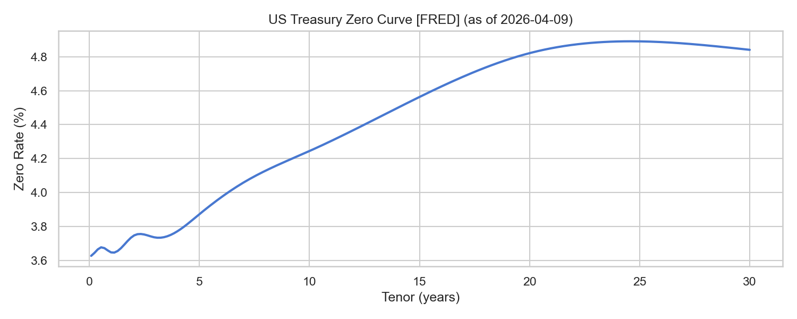
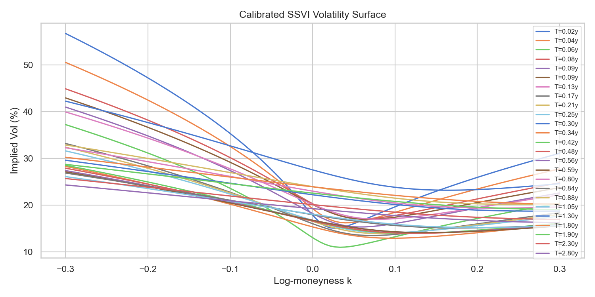
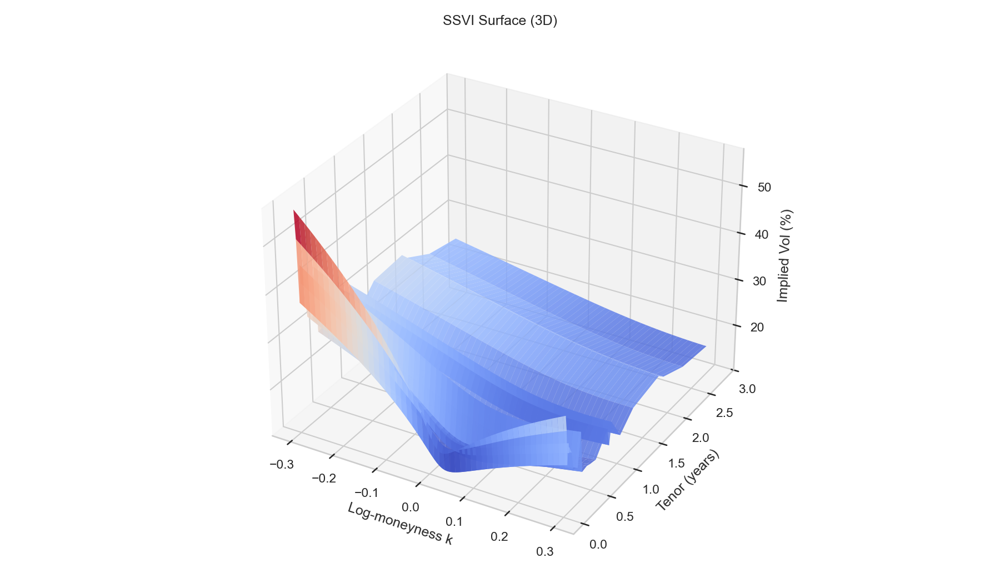
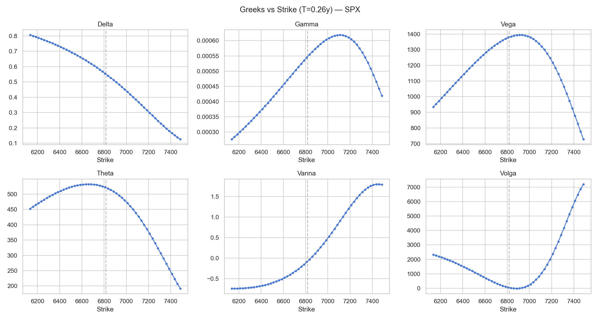
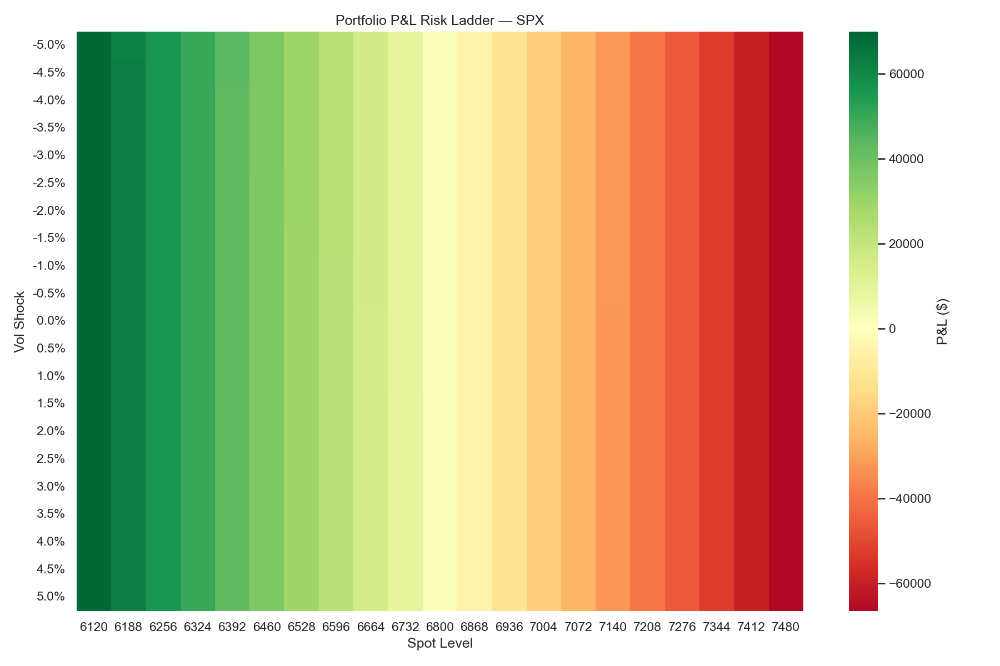
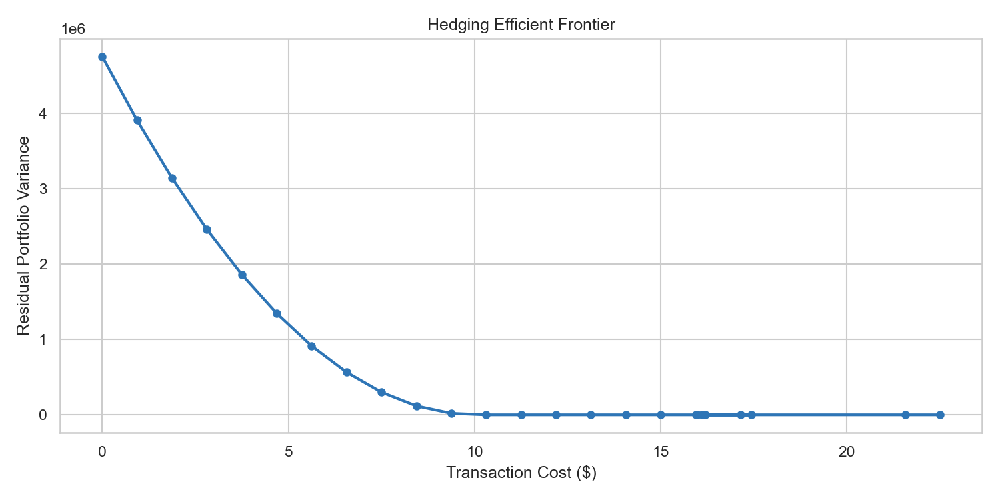

<div align="center">

<!-- AI-generated cover — replace with your own banner image -->


# Arbitrage-Free Volatility Surface & Flow Hedging Optimizer

**Quantitative pipeline for equity derivatives utilizing surface stochastic volatility inspired**

[](https://python.org)
[](https://isocpp.org)
[](https://pybind11.readthedocs.io)
[](https://scikit-learn.org)
[](LICENSE)

[Quick Start](#-quick-start) · [Architecture](#-architecture) · [Pipeline Walkthrough](#-pipeline-walkthrough) · [ML Warm-Start](#-ml-warm-start) · [Data Sources](#-data-sources)

</div>

---

## Overview

End-to-end derivatives pricing and risk system that calibrates an **arbitrage-free SSVI volatility surface** from live market data, computes full Greeks via a compiled C++17 engine, runs 2D scenario-based risk analysis, and optimises hedge portfolios on an efficient frontier — all from a single `python demo.py` call.

### Key Capabilities

| Module | What it does |
|--------|-------------|
| **C++ SSVI Engine** | Evaluates total variance + analytical derivatives at ~10M points/sec |
| **C++ Greeks Engine** | Black-Scholes pricing + finite-difference Greeks (delta through volga) |
| **Yield Curve** | Full FRED bootstrap (DGS1MO → DGS30), cubic spline interpolation |
| **Option Chain** | Live CBOE ingestion via yfinance — 8,000+ quotes across 35 expiries |
| **Dividend Model** | Historical projection + put-call parity implied extraction + blending |
| **Surface Calibration** | L-BFGS-B with arb penalty; calendar + butterfly checks post-fit |
| **Risk Ladder** | 2D full-revaluation P&L grid (spot × vol shocks) |
| **Hedge Optimizer** | SLSQP efficient frontier with transaction cost constraints |
| **ML Warm-Start** | GBT predicts SSVI param deltas → faster recalibration |
| **ETF Premium** | Two-factor spot/forward premium model with IV adjustment |

---

## Quick Start

```bash
# 1. Install dependencies
pip install -r qr_flow_project/requirements.txt

# 2. Build the C++ engine (required — no Python fallback)
cd qr_flow_project/cpp
python setup.py build_ext --inplace
# Windows: copy qr_engine*.pyd ..\
# Linux:   cp qr_engine*.so ../

# 3. Set your FRED API key
echo "FRED_API_KEY=your_key_here" > qr_flow_project/.env

# 4. Run the full demo (live data)
cd qr_flow_project
python demo.py
```

All 6 publication-ready plots are saved to `output/`:

```
output/
├── 01_yield_curve.png
├── 02_vol_surface.png
├── 03_vol_surface_3d.png
├── 04_greeks.png
├── 05_risk_ladder.png
├── 06_efficient_frontier.png
└── warm_start.pkl
```

---

## Architecture

```
C++17 (pybind11) ─── REQUIRED           Python 3.11+
┌─────────────────────┐                  ┌──────────────────────────────┐
│ ssvi.cpp             │                  │ data/fred_rates.py           │
│  SSVI eval + derivs  │                  │  FRED yield curve bootstrap  │
├─────────────────────┤                  ├──────────────────────────────┤
│ greeks.cpp           │     bindings     │ data/options_chain.py        │
│  BS pricer + Greeks  │◄───────────────►│  CBOE chain via yfinance     │
├─────────────────────┤   (pybind11)     ├──────────────────────────────┤
│ bindings.cpp         │                  │ data/dividends.py            │
│  Python ⇄ C++ bridge │                  │  Discrete + implied divs     │
└─────────────────────┘                  ├──────────────────────────────┤
                                          │ models/surface.py            │
                                          │  SSVI calibration orchestr.  │
                                          ├──────────────────────────────┤
                                          │ models/arb_detector.py       │
                                          │  Calendar + butterfly checks │
                                          ├──────────────────────────────┤
                                          │ models/etf_premium.py        │
                                          │  Two-factor premium model    │
                                          ├──────────────────────────────┤
                                          │ ml/warm_start.py             │
                                          │  GBT param delta predictor   │
                                          ├──────────────────────────────┤
                                          │ risk/risk_ladder.py          │
                                          │  2D full-revaluation grid    │
                                          ├──────────────────────────────┤
                                          │ risk/hedging.py              │
                                          │  Efficient frontier optimizer│
                                          └──────────────────────────────┘
```

---

## Pipeline Walkthrough

The full pipeline runs as a single script (`demo.py`) or interactively in `notebooks/walkthrough.ipynb`. Each section below shows real output from a live SPY run.

### 1 · C++ Engine Smoke Tests

The compiled `qr_engine` module exposes SSVI evaluation and Black-Scholes pricing directly to Python:

```python
from qr_engine.ssvi import total_variance, derivatives as ssvi_derivs
from qr_engine.greeks import bs_price, bs_implied_vol, compute as greeks_compute

# SSVI total variance at ATM
theta, rho, eta = 0.04, -0.25, 1.0
w = total_variance(0.0, theta, rho, eta)
# => 0.040000

# Analytical derivatives for arb checks
d = ssvi_derivs(0.0, theta, rho, eta)
# => w=0.040000, dw/dk=-0.050000, d2w/dk2=0.468750

# Black-Scholes call pricing
call_px = bs_price(585.0, 590.0, 0.25, 0.045, 0.18, True)
# => $18.4721
```

**Put-call parity verification:**

| Metric | Value |
|--------|-------|
| BS Call (F=585, K=590, T=0.25, σ=18%) | $18.4721 |
| BS Put | $23.4162 |
| C − P | −4.9441 |
| (F−K) × e⁻ʳᵀ | −4.9441 |
| IV round-trip error | 1.94 × 10⁻¹⁶ |

**Greeks (finite-difference via C++):**

| Greek | Value |
|-------|-------|
| Delta | 0.4749 |
| Gamma | 0.007481 |
| Vega | 115.2431 |
| Theta | 40.7750 |
| Vanna | 0.305474 |
| Volga | 4.4331 |

---

### 2 · Yield Curve (FRED)

Bootstrapped from 11 Treasury series (DGS1MO → DGS30) via cubic spline interpolation:

```python
from python.data.fred_rates import fetch_yield_curve

curve = fetch_yield_curve(FRED_API_KEY)
# [LIVE] Fetched yield curve from FRED (as of 2026-02-28)
```

| Tenor | Zero Rate | Discount Factor |
|-------|-----------|-----------------|
| 0.25y | 4.339% | 0.9892 |
| 1.00y | 4.218% | 0.9587 |
| 5.00y | 4.148% | 0.8123 |
| 10.00y | 4.443% | 0.6413 |

<div align="center">


*US Treasury zero curve bootstrapped from FRED — cubic spline through 11 tenor points*
</div>

---

### 3 · Option Chain (yfinance)

```python
from python.data.options_chain import fetch_yfinance
chain = fetch_yfinance("SPY")
# [LIVE] Fetched 8,951 quotes across 35 expiries for SPY (spot=685.99)
```

| Expiry | T (years) | Quotes |
|--------|-----------|--------|
| 2026-03-06 | 0.011 | 265 |
| 2026-03-20 | 0.049 | 382 |
| 2026-03-31 | 0.079 | 503 |
| 2026-06-18 | 0.296 | 267 |
| 2026-12-18 | 0.797 | 286 |
| 2027-06-17 | 1.292 | 294 |
| 2028-06-16 | 2.292 | 328 |
| 2028-12-15 | 2.790 | 314 |

---

### 4 · Dividends: Historical + Implied + Blended

Three-stage dividend pipeline: project from history, extract implied via put-call parity, blend:

```python
from python.data.dividends import (
    fetch_dividends, project_from_history,
    extract_implied_dividends, decompose_implied_dividends,
    blend_dividends, build_forward_curve,
)

hist_divs = fetch_dividends("SPY", period="3y")   # 12 historical
projected = project_from_history(hist_divs)         # 6 projected
implied_pvs = extract_implied_dividends(chain, curve)
blended = blend_dividends(projected_hist, implied_divs, method="prefer_implied")
```

**Blended dividend schedule (implied where available):**

| Ex-Date | Amount | Source |
|---------|--------|--------|
| 2026-03-20 | $0.80 | implied |
| 2026-06-19 | $0.77 | implied |
| 2026-09-18 | $0.03 | implied |
| 2026-12-18 | $0.92 | implied |
| 2027-03-19 | $0.73 | implied |
| 2027-06-18 | $3.53 | implied |

**Forward curve (historical vs implied-adjusted):**

| Expiry | T | F_hist | F_implied | Diff |
|--------|---|--------|-----------|------|
| 2026-03-20 | 0.049y | 685.42 | 686.45 | +1.02 |
| 2026-06-30 | 0.329y | 690.54 | 692.63 | +2.08 |
| 2026-12-18 | 0.797y | 698.13 | 702.95 | +4.82 |
| 2027-06-17 | 1.292y | 707.92 | 713.92 | +6.00 |
| 2028-12-15 | 2.790y | 742.86 | 747.38 | +4.52 |

---

### 5 · SSVI Surface Calibration + Arb Detection

Slice-by-slice L-BFGS-B optimisation with automated arb correction:

```python
from python.models.surface import calibrate_surface

surface = calibrate_surface(chain, forwards, curve)
# Calibrated 30 tenor slices in 0.5095 seconds
#   Timing: prep=0.1281s (25%), opt=0.2727s (54%)
#   Pre-correction arb violations:  45
#   Post-correction arb violations: 45
```

**Calibrated SSVI parameters (sample):**

| Tenor | θ (ATM var) | ρ (skew) | η (curvature) |
|-------|-------------|----------|----------------|
| 0.049y | 0.0007 | −0.2999 | 0.4998 |
| 0.126y | 0.0038 | −0.2999 | 0.4998 |
| 0.296y | 0.0183 | −0.2999 | 0.4998 |
| 0.797y | 0.0450 | −0.2999 | 0.4998 |
| 1.292y | 0.0642 | −0.2999 | 0.4998 |
| 2.790y | 0.1030 | −0.2999 | 0.4998 |

<div align="center">


*Implied volatility smile across all calibrated tenors*
</div>

<div align="center">


*3D SSVI surface — log-moneyness × tenor × implied vol*
</div>

---

### 6 · Greeks Computation

Full Greeks surface computed via C++ finite-difference engine across a strike ladder:

```python
g = greeks_compute(F_greeks, K_g, T_greeks, r_greeks, sigma_g, True)
```

<div align="center">


*Delta, Gamma, Vega, Theta, Vanna, Volga across strikes for a near-term expiry*
</div>

---

### 7 · Risk Ladder (2D Full Revaluation)

Portfolio: long 100 × 580C, short 200 × 590C, long 100 × 600P — a classic butterfly with directional tilt.

```python
from python.risk.risk_ladder import compute_risk_ladder

ladder = compute_risk_ladder(positions, surface, curve, spot,
                             spot_shocks_pct=spot_shocks_pct)
# Portfolio base value: $-2628.54
# P&L matrix shape: (21, 7)
# Max gain: $2149.86, Max loss: $-1767.46
```

<div align="center">


*2D P&L heatmap — spot level vs vol shock scenarios*
</div>

---

### 8 · Hedging Efficient Frontier

Optimises hedge ratios across 4 instruments under transaction cost constraints:

```python
from python.risk.hedging import build_scenario_pnl_matrix, compute_efficient_frontier

frontier = compute_efficient_frontier(portfolio_pnl, hedge_pnl,
                                      hedge_costs, budget_steps=25)
# 25 frontier points
# Unhedged variance: 262.84
# Best hedged variance: 0.12 (cost $0.95)
```

<div align="center">


*Variance-cost tradeoff — SLSQP optimizer with bid-ask cost constraints*
</div>

---

### 9 · ETF Premium / Discount Analysis

Two-factor model decomposes spot and forward premiums, adjusts implied vol:

```python
from python.models.etf_premium import estimate_premium, adjust_surface_for_premium

premium = estimate_premium(spot, nav, forwards[exp], nav_fwd, T)
# ETF trades at +0.20% to NAV (spot). Forward implies +0.20% premium.

adj_iv = adjust_surface_for_premium(0.18, premium['spot_premium_pct'], T)
# Raw IV: 18.00% -> Premium-adjusted IV: 17.92%
```

---

## ML Warm-Start

A gradient-boosted tree model predicts SSVI parameter *deltas* from observable market features to warm-start the constrained calibration optimizer.

### How it works

```
                    ┌─────────────────────┐
  Market Features   │   GBT Predictor     │   Predicted Δθ, Δρ, Δη
  ─────────────────►│  (scikit-learn)      │──────────────────────────►  Initial guess
  VIX, yield slope, │  n_estimators=100    │                             for L-BFGS-B
  rvol, PCR, prev   │  max_depth=3         │
                    └─────────────────────┘
                              │
                              ▼
                    Arb-free guarantee:
                    UNCONDITIONALLY PRESERVED
                    (GBT is only the initial guess)
```

### Feature set

| Feature | Source | Description |
|---------|--------|-------------|
| `prev_theta`, `prev_rho`, `prev_eta` | Prior calibration | Yesterday's SSVI params |
| `vix` | FRED (VIXCLS) | Market fear gauge |
| `yield_slope_10y_2y` | FRED (DGS10 − DGS2) | Curve steepness |
| `rvol_1d`, `rvol_5d`, `rvol_20d` | Computed | Realised vol at multiple horizons |
| `put_call_volume_ratio` | Option chain | Sentiment proxy |

### Training & comparison

```python
ws_model = WarmStartModel(n_estimators=100, max_depth=3)
ws_model.train(train_df)  # 6,000 synthetic samples

surface_cold = calibrate_surface(chain, forwards, curve)
surface_ml   = calibrate_surface(chain, forwards, curve,
                                  prev_surface=surface,
                                  warm_start_model=ws_model,
                                  market_features=features,
                                  _cached_slices=surface_cold._cached_slices)
```

**Classical vs ML-assisted parameters (sample):**

| Tenor | Classical (θ, ρ, η) | ML Warm-Start (θ, ρ, η) |
|-------|---------------------|--------------------------|
| 0.049 | (0.0007, −0.2999, 0.4998) | (0.0007, −0.3000, 0.4999) |
| 0.296 | (0.0183, −0.2999, 0.4998) | (0.0188, −0.3000, 0.4999) |
| 0.797 | (0.0450, −0.2999, 0.4998) | (0.0417, −0.3000, 0.4999) |
| 1.292 | (0.0642, −0.2999, 0.4998) | (0.0642, −0.3000, 0.4999) |
| 2.790 | (0.1030, −0.2999, 0.4998) | (0.1030, −0.3000, 0.4999) |

> The ML prediction is purely an initial guess. The L-BFGS-B optimizer with arb penalty terms still runs to full convergence. A poor prediction simply means more iterations — **never** an arb-violating surface.

---

## Data Sources

| Data | Source | Series / Format |
|------|--------|----------------|
| Risk-free rates | FRED API | DGS1MO through DGS30 (11 tenors) |
| VIX (ML feature) | FRED API | VIXCLS |
| Options chains | Yahoo Finance | yfinance delayed quotes |
| Dividends (hist) | Yahoo Finance | Ex-date + amount |
| Dividends (implied) | Computed | Put-call parity extraction |
| ETF NAV | Published iNAV | Where available |

**No hardcoded rates. No simulated spreads. No fallback cache.**

---

## Tech Stack

```
Language        Purpose                      Key libraries
──────────────  ───────────────────────────  ──────────────────────
C++17           SSVI engine, BS pricer       pybind11
Python 3.11+    Orchestration, data, ML      numpy, scipy, pandas
                Yield curve                  fredapi, CubicSpline
                Options data                 yfinance
                ML warm-start                scikit-learn (GBT)
                Visualisation                matplotlib, seaborn
                Notebook demo                Jupyter
```

---

## Tests

```bash
cd qr_flow_project
python -m pytest tests/ -v
```

| Test module | Coverage |
|-------------|----------|
| `test_types.py` | Data structures, YieldCurve, OptionChain |
| `test_data_fetchers.py` | FRED + yfinance integration |
| `test_etf_premium.py` | Premium model edge cases |
| `test_hedging.py` | Frontier optimizer constraints |
| `test_engine.py` | C++ engine bindings |
| `test_dividends.py` | Implied dividend extraction |

---

## Project Structure

```
Derivative modelling/
├── README.md                          ← You are here
├── qr_flow_project/
│   ├── cpp/
│   │   ├── ssvi.hpp / ssvi.cpp        C++ SSVI engine
│   │   ├── greeks.hpp / greeks.cpp    C++ Greeks engine
│   │   ├── bindings.cpp               pybind11 bridge
│   │   └── setup.py                   Build script
│   ├── python/
│   │   ├── types.py                   Shared data structures
│   │   ├── data/
│   │   │   ├── fred_rates.py          FRED yield curve
│   │   │   ├── options_chain.py       CBOE chain ingestion
│   │   │   └── dividends.py           Discrete dividend model
│   │   ├── models/
│   │   │   ├── surface.py             SSVI calibration orchestrator
│   │   │   ├── arb_detector.py        Calendar + butterfly checks
│   │   │   └── etf_premium.py         ETF premium/discount model
│   │   ├── ml/
│   │   │   └── warm_start.py          GBT warm-start predictor
│   │   └── risk/
│   │       ├── risk_ladder.py         2D full-revaluation grid
│   │       └── hedging.py             Efficient frontier optimizer
│   ├── tests/                         pytest suite
│   ├── notebooks/
│   │   └── walkthrough.ipynb          Interactive demo notebook
│   ├── demo.py                        Full pipeline script
│   ├── requirements.txt               Python dependencies
│   └── .env                           API keys (not committed)
└── output/                            Generated plots + models
```

---

<div align="center">

*Built with C++17, Python, and a lot of Greeks.*

</div>
